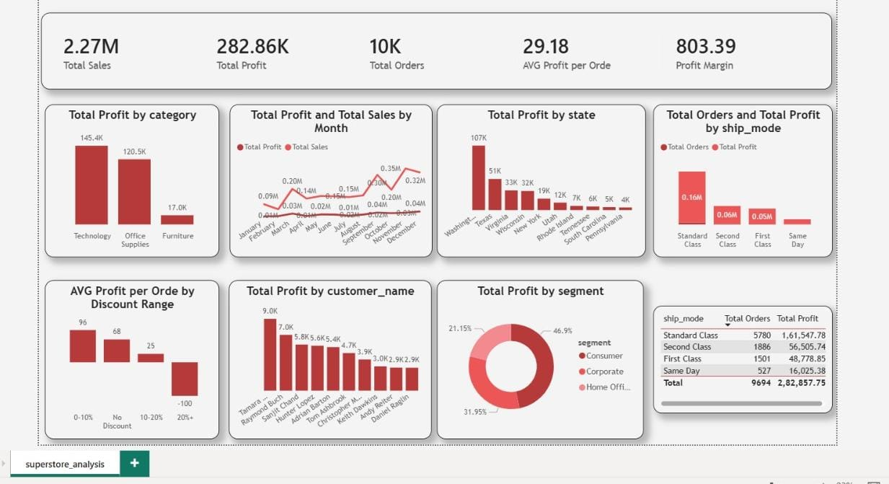

# PowerBI-Superstore-Dashboard
Interactive Power BI dashboard for Superstore sales data analysis
# 📊 Superstore Sales Dashboard - Power BI

## 🎯 Project Overview
Interactive Power BI dashboard analyzing Superstore sales data (9,694 transactions, $2.27M sales).

## 📈 Key Metrics

| Metric | Value |
|:---|:---|
| Total Sales | $2,272,450 |
| Total Profit | $282,858 |
| Profit Margin | 12.45% |
| Total Orders | 9,694 |

## 📊 Dashboard Preview

## 🔍 Dashboard Features

| Visual | Insight |
|:---|:---|
| KPI Cards | Sales, Profit, Margin, Orders |
| Category Bar Chart | Technology (17.39%) vs Furniture (2.32%) |
| Monthly Trend Line | November-December sales spike 35-50% |
| Discount Impact | 20%+ discounts = $100 loss per order |
| Top Customers | Tamara Chand: $8,964 profit |

## 💡 Business Recommendations

1. **Limit discounts to 10%** - 20%+ discounts cause losses
2. **Review Furniture pricing** - Only 2.32% margin
3. **Increase inventory before November** - Holiday season spike

## 🛠️ Tools Used
- Power BI Desktop
- DAX Measures
- Superstore Dataset (CSV)

## 📁 Files
- `superstore_analysis.pbix` - Power BI file
- `superstore` - Dashboard preview

## 👨‍💻 Author
**Toufik Gafur Shaikh**
- GitHub: github.com/TO185
- Portfolio: to185.github.io/Data_Analysis
